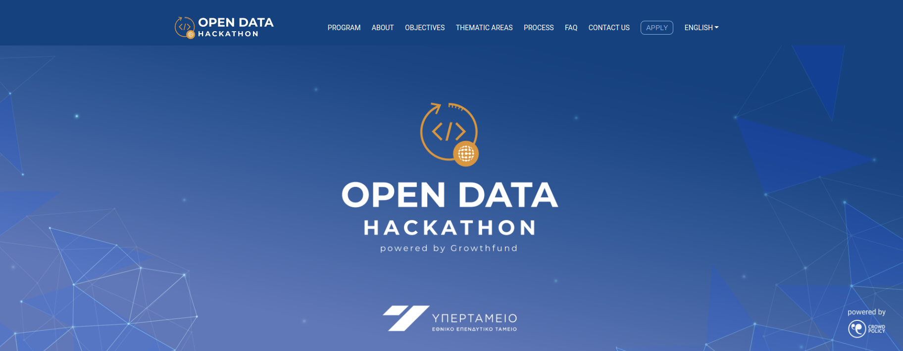
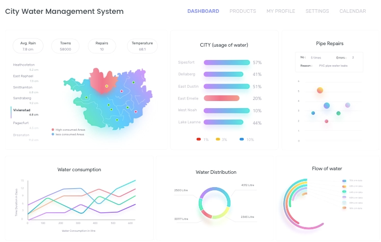

# Open-Data-Hackathon



**Django Dashboard** created by `DataMinds` for the needs of Open Data Hackathon. The application is an end-to-end product, utilizing machine learning technologies to forecast water consumptions in households and to give and overall view of the water and pipes managements across the country. 


# TEAM BEHIND IT
The team behind this idea are 3 engineers with strong background in machine learning and AI 

* Panagiotis Papaemmanouil [ LinkedIn](https://www.linkedin.com/in/panagiotis-papaemmanouil/)
* Lazaros Paschalidis [ LinkedIn](https://www.linkedin.com/in/lazaros-paschalidis-6a5074118/)
* Themistoklis Spanoudis [ LinkedIn](https://www.linkedin.com/in/themistoklis-spanoudis/)


<br />

> 🚀 Built with python django and mahcine learning

- ✅ `Up-to-date dependencies`
- ✅ Database: `sqlite`
- ✅ `Authentication`, Session Based, `OAuth` via **Github**
- ✅ `Dark Mode` (persistent)
- ✅ Docker
  
<br />

# Final Product (UI/UX)



## ✨ Start the app in Docker

> 👉 **Step 1** - Download the code from the repository (using `GIT`) 

```bash
$ git clone https://github.com/lazaros-23/open-data-hackathon.git
$ cd app
```

<br />

> 👉 **Step 2** - Start the APP in `Docker`

```bash
$ docker-compose up --build 
```

Visit `http://localhost:5085` in your browser. The app should be up & running.


## 🛠️ Tools Used

### 🧰 Frameworks, libraries and DB

<p>
    <a href="https://www.djangoproject.com/"></a>
    <a href=""></a>
    <a href="https://www.javascript.com/"></a>
    <a href="https://pandas.pydata.org/"></a>
    <a href="https://www.tensorflow.org/"></a>
    <a href="https://plotly.com/"></a>
    <a href="https://plotly.com/dash/"></a>
    <a href="https://www.postgresql.org/"></a>
    <a href="https://www.mongodb.com/"></a>
    <a href="https://www.mysql.com/"></a>
    <a href="https://www.sqlite.org/index.html"></a>
</p>


### 💻 Software and tools

<p>
   <a href="https://www.linux.org/"></a>
   <a href="https://ubuntu.com/"></a>
   <a href="https://jupyter.org/"></a>
    <a href="https://code.visualstudio.com/"></a>
    <a href="https://colab.research.google.com/?utm_source=scs-index"></a>
    <a href="https://www.docker.com/"></a>
    <a href="https://git-scm.com/"></a>
    
   
</p>
